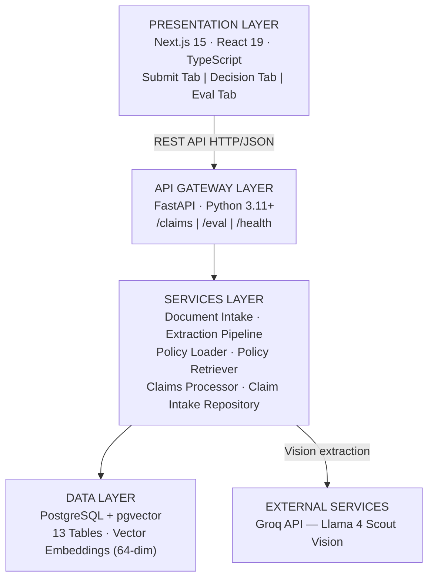
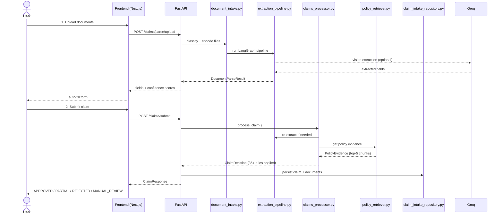
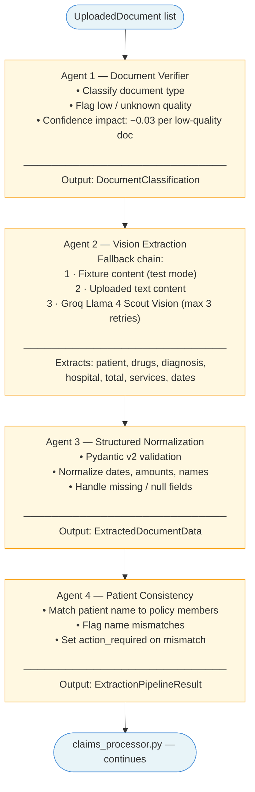
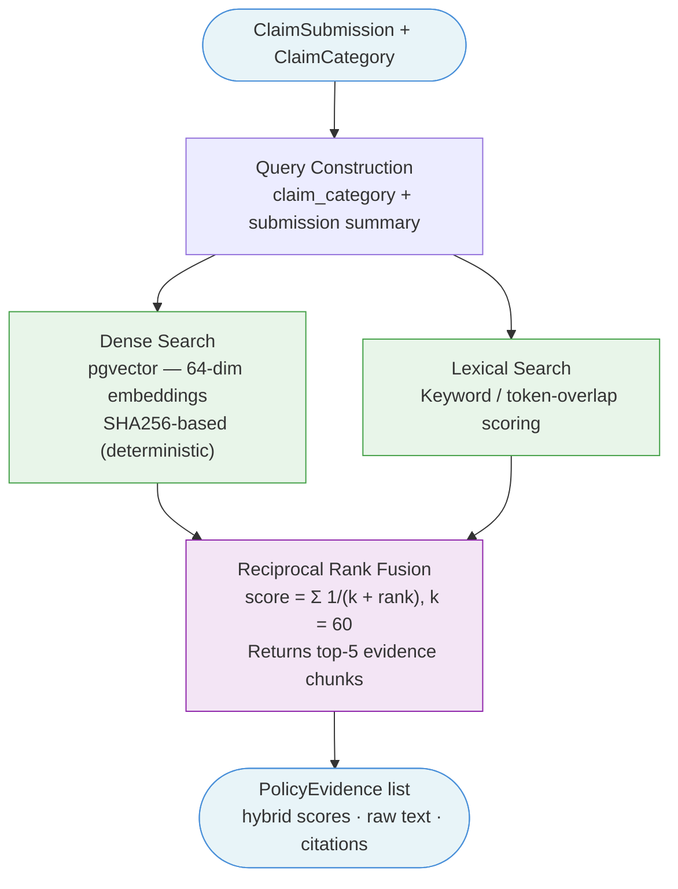

# Plum Health Insurance Claims Processing System

An automated, explainable AI system for adjudicating employee health insurance claims — built for Plum's AI Engineer assignment.

---

## What It Does

Accepts a claim submission (member details, treatment type, claimed amount, uploaded documents), validates documents against policy requirements, extracts structured information, applies 35+ deterministic policy rules, and returns a final decision (`APPROVED`, `PARTIAL`, `REJECTED`, `MANUAL_REVIEW`) with a complete audit trace.

---

## Repository Structure

```
.
├── assignment.md              # Assignment specification
├── policy_terms.json          # Policy configuration, coverage rules, member roster
├── test_cases.json            # 12 test scenarios with expected outcomes
├── sample_documents_guide.md  # Indian medical document format reference
├── plan.md                    # Phase-wise implementation notes
├── backend/                   # FastAPI + LangGraph Python backend
├── frontend/                  # Next.js ops review UI
└── docs/
    ├── architecture_design.md # Full architecture design (Eraser.io-ready)
    ├── component_contracts.md # Typed contracts for every component
    └── eval_report.md         # Results for all 12 test cases
```

---

## System Architecture

### High-Level Layers



### End-to-End Data Flow



---

## Document Extraction Pipeline (LangGraph)

A stateful 4-agent pipeline orchestrated with LangGraph. Each agent has typed edges and a defined failure fallback.



> **Fast-path:** If documents were already extracted during `/parse/upload` and content hasn't changed, Agent 2 is skipped and cached results are reused.

---

## Claims Adjudication Rules Engine

35+ deterministic Python rules applied in strict order. No LLM is involved in adjudication — full auditability guaranteed.

```mermaid
flowchart TD
    IN([ClaimSubmission + PolicyTerms]) --> GATE

    GATE["GATE RULES — immediate REJECTED on fail
    R01 · Policy ID mismatch
    R02 · Member not found in policy
    R03 · Policy not active (date check)
    R04 · Submission deadline exceeded
    R05 · Amount below minimum threshold
    R06 · Claim category not covered"]

    GATE -->|pass| DOC

    DOC["DOCUMENT RULES — ACTION_REQUIRED on fail
    D01 · Required documents missing
    D02 · Document quality too low (UNREADABLE)
    D03 · Patient name inconsistency vs policy"]

    DOC -->|pass| COV

    COV["COVERAGE RULES — REJECTED on fail
    C01 · Condition exclusion check
    C02 · Dental exclusion check
    C03 · Vision exclusion check
    C04 · Initial waiting period
    C05 · Pre-existing condition waiting period
    C06 · Specific condition waiting period"]

    COV -->|pass| FIN

    FIN["FINANCIAL RULES — PARTIAL on constraint hit
    F01 · Per-claim limit cap
    F02 · Annual OPD limit check
    F03 · Family floater limit check
    F04 · Co-pay deduction (per category %)
    F05 · Sub-limit per OPD category"]

    FIN -->|pass| COMP

    COMP["COMPLIANCE RULES
    X01 · Pre-authorization required check
    X02 · Network hospital validation
    X03 · MANUAL_REVIEW if pre-auth not confirmed"]

    COMP -->|pass| FRAUD

    FRAUD["FRAUD DETECTION
    FR1 · Same-day claims count threshold
    FR2 · Monthly claims count threshold
    FR3 · High-value claim threshold
    FR4 · Composite fraud score → MANUAL_REVIEW"]

    FRAUD -->|pass| LINE

    LINE["LINE ITEM ADJUDICATION
    Per service line:
    APPROVED / REJECTED / ADJUSTED / REVIEW"]

    LINE --> CONF

    CONF["CONFIDENCE SCORING (0.0 – 1.0)
    Base: 0.9
    −0.03 per low-quality doc
    −0.05 per missing field
    −0.10 per component failure
    −0.15 if no policy evidence found"]

    CONF --> OUT

    OUT(["ClaimDecision
    decision · approved_amount · claimed_amount
    confidence · rejection_reasons · line_items"])

    GATE -->|fail| REJ([REJECTED])
    DOC  -->|fail| ACT([ACTION_REQUIRED])
    COV  -->|fail| REJ
    COMP -->|pre-auth| MAN([MANUAL_REVIEW])
    FRAUD-->|score high| MAN

    style IN   fill:#e8f4f8,stroke:#4a90d9
    style OUT  fill:#e8f4f8,stroke:#4a90d9
    style GATE fill:#fdecea,stroke:#e53935
    style DOC  fill:#fff3e0,stroke:#fb8c00
    style COV  fill:#fdecea,stroke:#e53935
    style FIN  fill:#fffde7,stroke:#fdd835
    style COMP fill:#e8f5e9,stroke:#43a047
    style FRAUD fill:#fdecea,stroke:#e53935
    style LINE fill:#e8f5e9,stroke:#43a047
    style CONF fill:#e8f5e9,stroke:#43a047
    style REJ  fill:#fdecea,stroke:#e53935
    style ACT  fill:#fff3e0,stroke:#fb8c00
    style MAN  fill:#fffde7,stroke:#fdd835
```



---

## Policy Retrieval (Hybrid Search)

Policy evidence is retrieved by combining dense vector search and lexical keyword matching, fused with Reciprocal Rank Fusion (RRF).



**Indexed knowledge chunks:** `coverage_limits` · `opd_category` · `waiting_periods` · `exclusions` · `pre_authorization` · `submission_rules` · `fraud_thresholds` · `network_hospitals`

---

## Technology Stack

### Frontend

| Layer | Technology |
|---|---|
| Framework | Next.js 15 (App Router) |
| UI | React 19 + TypeScript 5.5 |
| State | React hooks only |
| API state | TanStack React Query |
| Styling | Tailwind CSS 3.4 + PostCSS |
| Icons | Lucide React |
| Runtime | Node.js 18+ |

### Backend

| Layer | Technology |
|---|---|
| API server | FastAPI + Uvicorn (Python 3.11+) |
| Validation | Pydantic v2 + Pydantic Settings |
| Agent orchestration | LangGraph |
| LLM framework | LangChain |
| LLM provider | Groq SDK (Llama 4 Scout) |
| ORM | SQLAlchemy 2.0 |
| Migrations | Alembic |
| DB driver | psycopg3 |
| Vector search | pgvector |
| PDF parsing | pypdf |
| File upload | python-multipart |
| Testing | pytest + httpx |
| Linting | ruff |

### External Services

| Service | Purpose | Fallback |
|---|---|---|
| Groq Cloud (Llama 4 Scout) | Vision extraction + doc classification | Deterministic filename inference |
| Neon.tech PostgreSQL + pgvector | Claim storage + vector search | In-memory mode |

---

## Key Design Decisions

| Decision | Choice | Reason |
|---|---|---|
| LLM Framework | LangGraph | Stateful multi-agent pipeline with typed edges |
| LLM Provider | Groq (Llama 4 Scout) | Vision capability for medical doc images |
| Vector DB | pgvector (in PostgreSQL) | Avoids a separate vector DB service |
| Embeddings | Deterministic (SHA256-based) | No LLM call needed for indexing; fully reproducible |
| Hybrid Search | Dense + Lexical + RRF | Better recall than pure semantic or keyword alone |
| DB Optional | In-memory fallback | Zero-config local development |
| LLM Optional | Deterministic fallback | System works without a Groq key for testing |
| Frontend | Single-page (3 tabs) | Simple ops-team UX; no complex navigation needed |
| State | React hooks only | No Redux/Zustand needed for this scope |
| Auth | None | Internal ops tool; authentication deferred |
| Rules Engine | Deterministic Python | Full auditability; no LLM hallucination in decisions |

---

## Error Handling & Resilience

| Layer | Trigger | Behavior |
|---|---|---|
| LLM Unavailable | No `GROQ_API_KEY` or Groq API down | Falls back to deterministic extraction from text content |
| Database Unavailable | `DATABASE_URL` not set or DB unreachable | In-memory mode; policy loaded from JSON |
| Low Quality Document | Doc marked `UNREADABLE` or `LOW` | Returns `ACTION_REQUIRED`; prompts user to re-upload |
| Name Mismatch | Patient name doesn't match any policy member | Returns `ACTION_REQUIRED`; asks user to confirm member |
| Component Failure | Any service throws unexpected exception | `ComponentFailure` recorded; confidence reduced; `MANUAL_REVIEW` if too many |

---

## Local Setup

### Prerequisites

- Python 3.11+
- Node.js 18+
- PostgreSQL with `pgvector` extension ([Neon](https://neon.tech) offers a free hosted option)
- Groq API key (optional — system falls back to deterministic mode without it)

### Backend

```bash
cd backend
python -m venv .venv
source .venv/bin/activate       # Windows: .venv\Scripts\activate
pip install -r requirements-dev.txt
cp .env.example .env            # fill in DATABASE_URL and GROQ_API_KEY
alembic upgrade head
uvicorn app.main:app --reload
```

Verify: `curl http://localhost:8000/health` → `{"status":"ok"}`

Interactive API docs: [http://localhost:8000/docs](http://localhost:8000/docs)

### Frontend

```bash
cd frontend
npm install
cp .env.example .env.local      # set NEXT_PUBLIC_API_BASE_URL
npm run dev
```

Frontend: [http://localhost:3000](http://localhost:3000)

### Tests

```bash
cd backend
pytest                          # runs in-memory, no DB required
pytest tests/test_claims_contract.py -v
```

### Eval Suite

```bash
# With backend running:
curl -X POST http://localhost:8000/eval/run | python -m json.tool
# Or use the Eval tab in the UI
```

---

## Deployment

| Layer | Target |
|---|---|
| Backend | [Render](https://render.com) — `uvicorn app.main:app --host 0.0.0.0 --port $PORT` |
| Frontend | Render — `npm run build && npm start` |
| Database | [Neon](https://neon.tech) Postgres with `pgvector` |
| LLM | [Groq](https://console.groq.com) — `meta-llama/llama-4-scout-17b-16e-instruct` |

Set `ENVIRONMENT=production` in deployed environments.

---

## API Reference

| Method | Path | Purpose |
|---|---|---|
| `GET` | `/health` | Health check |
| `GET` | `/claims/context` | Policy metadata + member roster |
| `GET` | `/claims/members/{member_id}/ytd` | YTD used/remaining amounts per category |
| `POST` | `/claims/submit` | Submit a claim as JSON |
| `POST` | `/claims/submit/upload` | Submit a claim with file uploads |
| `POST` | `/claims/parse/upload` | Extract document fields only (no adjudication) |
| `GET` | `/claims/{claim_id}` | Fetch a claim response and full trace |
| `POST` | `/eval/run` | Run all 12 test cases |
| `GET` | `/eval/latest` | Fetch the last eval run |

---

## Key Documents

- **`docs/architecture_design.md`** — Full architecture design with all diagrams, ready for Eraser.io
- **`docs/component_contracts.md`** — Typed input/output/error contracts for every component
- **`docs/eval_report.md`** — Decision accuracy on all 12 test cases with full traces
